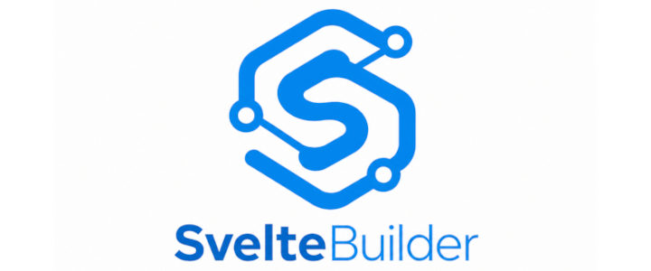
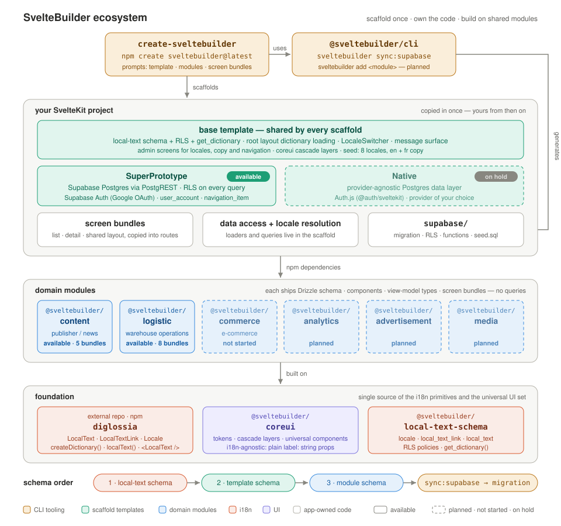

> Scaffolding + component ecosystem for building quality SvelteKit applications, fast.

SvelteBuilder is an opinionated scaffold and toolkit ecosystem for SvelteKit projects that need to be production-ready quickly. It ships with first-class localization, accessibility foundations (building on the wonderful work done by [bits-ui](https://github.com/huntabyte/bits-ui)), a clean set of common UI components, and strong established patterns for schema, routing, data access, auth, and error handling.

For more details on the _what_ and _why_, see the [About](#About) section.

> [!TIP]
> **Quick start:** create a project and choose the **SuperPrototype** template when prompted:
>
> ```sh
> pnpm create sveltebuilder@latest my-app
> cd my-app && cp .env.example .env
> ```
>
> Then link a hosted Supabase project, and set `PUBLIC_SUPABASE_URL` and `PUBLIC_SUPABASE_PUBLISHABLE_KEY` in `.env` from its API settings:
>
> ```sh
> pnpm supabase link --project-ref <project-ref>
> pnpm supabase db push --include-seed
> pnpm dev
> ```
>
> **Or** run Supabase locally. `db:start` prints the local URL and publishable key for `.env`:
>
> ```sh
> pnpm db:start
> pnpm db:reset
> pnpm dev
> ```
>
> Local Supabase needs [Docker](https://docs.docker.com/get-docker/). See [The CLI](#the-cli) for the prompts and non-interactive flags.
>
> Currently **_Admin Auth_** only supports Supabase + Google. You will need to configure Supabase Auth and a matching Google Client with valid URLs for your project, as you normally would. The first account to login automatically gains administrator privileges.
>
> See the [SuperPrototype setup guide](docs/superprototype-setup.md) for detailed instructions.

> [!NOTE]
> **Status: Beta in progress.** The foundation (`diglossia`, `@sveltebuilder/cli`, the base and SuperPrototype scaffold templates) and `@sveltebuilder/coreui` are complete and published to npm. Two domain modules, `content` and `logistic`, are usable today; `logistic` has no unit test suite yet, and the WCAG audit is half done: every component passes automated WCAG 2.2 AA checks in CI, but no manual review has been run. APIs may still change.

## Ecosystem Overview



### Monorepo Structure

```
SvelteBuilder/
├── packages/
│   ├── local-text-schema/  → @sveltebuilder/local-text-schema
│   ├── coreui/             → @sveltebuilder/coreui
│   ├── content/            → @sveltebuilder/content
│   ├── commerce/           → @sveltebuilder/commerce
│   └── logistic/           → @sveltebuilder/logistic
├── tools/
│   ├── create/             → create-sveltebuilder
│   └── cli/                → @sveltebuilder/cli
└── apps/
    └── docs/
```

`diglossia`, the i18n primitives package (formerly `@sveltebuilder/hermes`), has been extracted
to [its own repo](https://github.com/cailenfisher/diglossia) and is consumed here as an external
dependency rather than a workspace package.

---

### Foundational Layer

**`diglossia`** provides the i18n primitives used throughout the entire ecosystem: the `LocalText` type, `LocalTextLink`, the `Locale` type, `createDictionary()`, the `<LocalText />` Svelte component (from `diglossia/svelte`), and the `DictionaryInstance.localText(slug, scope, entityId)` method. It is the single source of these — no other package redeclares them.

> [!NOTE]
> **_Why a custom i18n layer?_** Paraglide is built for messages known at build time, and its own FAQ sends runtime and CMS content elsewhere. Storing translated entity copy in link tables is a well-established pattern (Rails' Mobility, Vendure, Strapi), but it usually lives inside a server framework or CMS. SvelteBuilder puts UI strings and entity copy under one key scheme and one read API, using diglossia for lookups. [Read the full rationale →](https://github.com/cailenfisher/SvelteBuilder/wiki/Why-a-Custom-i18n-Toolkit)

**`@sveltebuilder/coreui`** provides universal UI elements shared across all domain-specific modules. Application-level UI components (buttons, layout chrome, forms, navigation) are i18n-agnostic — they accept a plain `label: string` and ordinary child snippets, exactly like any normal Svelte component. Entity-aware display components (most of which live in the domain modules) receive the entity itself and resolve its localized copy through `diglossia`, from context by default or from an explicitly passed `dictionary` prop.

> [!NOTE]
> **_Why a custom UI library?_** Off-the-shelf component libraries make assumptions about structure, styling, and accessibility that break down at the edges of real enterprise applications — especially across niche industries. SvelteBuilder's UI layer is built around the repeating problems found across years of production web application development, with semantic HTML and WCAG compliance as non-negotiable defaults. [Read the full rationale →](https://github.com/cailenfisher/SvelteBuilder/wiki/Why-a-Custom-UI-Library)

---

### Domain-Specific Modules

Domain modules provide production-grade implementations for specific application domains. Each is a standalone npm package containing its Drizzle schema, its components, and the view-model types its screens are written against. It contains no queries: data access belongs to the scaffold.

Selecting a module in `create-sveltebuilder` does the rest. The CLI registers the module's schema, copies its seed and supplemental SQL (RLS policies, functions), and offers its **screen bundles**: complete features such as a list, its detail page, and any layout they share. You choose which bundles to scaffold. Screens are copied into your routes once and belong to your app from then on; they are not a dependency you track.

```ts
import { ArticleCard, ArticleView } from '@sveltebuilder/content';
```

All domain modules consume `@sveltebuilder/coreui` components wherever possible. When overlap is identified across multiple modules, new additions are proposed to the core library rather than duplicated.

Modules:

- **`@sveltebuilder/content`** — publisher/news: structured articles, sections and taxonomy, live coverage, front curation, newsletters, editorial workflow, RSS, news sitemaps, JSON-LD. _Available — 5 screen bundles._
- **`@sveltebuilder/logistic`** — warehouse operations: suppliers, storage locations, stock levels, receiving, pick tasks, shipments, returns, cycle counts. _Available — 8 screen bundles._
- **`@sveltebuilder/commerce`** — e-commerce workflows. _Not started._
- **`@sveltebuilder/analytics`** — _Planned._
- **`@sveltebuilder/advertisement`** — _Planned._
- **`@sveltebuilder/media`** — _Planned._

---

### The CLI

**`create-sveltebuilder`** is the one-time project scaffolding tool, invoked via:

```sh
npm create sveltebuilder@latest
```

It prompts for project name, scaffold template, package manager, modules, and screen bundles, then copies the selected files, writes schema registry entries, runs `sveltebuilder sync:supabase`, and installs dependencies. Every prompt can be answered by a flag instead (`--template`, `--pm`, `--modules`, `--screens`), so a fully flagged run is non-interactive.

**`@sveltebuilder/cli`** handles ongoing project management:

```sh
sveltebuilder sync:supabase   # Drizzle schemas → Supabase migration, plus RLS/functions and seed.sql
```

Adding a module to an existing project (`sveltebuilder add <module>`) is planned but not built.

`create-sveltebuilder` depends on `@sveltebuilder/cli` internally — sync logic is never duplicated.

---

## Scaffold Templates

Every SvelteBuilder project starts from the **base** — the provider-neutral foundation that all templates share. Base includes:

- The local-text schema (`locale`, `local_text_link`, `local_text`) with its RLS policies and the `get_dictionary` SQL function
- Root layout with dictionary loading, the `LocaleSwitcher`, and the message surface (toasts, banners, live region)
- Admin screens for locales, localized copy, and navigation items (the UI half; the template supplies the loaders)
- The CSS cascade-layer setup that integrates coreui's styles
- Seed data (8 locales, English and French application copy), generated by `sync:supabase`

On top of base, you choose a scaffold template:

### SvelteBuilder SuperPrototype

The batteries-included starting point, and currently the only available template. It is built the Supabase way rather than behind a portability layer, for projects that intend to stay on Supabase.

- **Database:** Supabase Postgres, reached only through the Data API (PostgREST) with `@supabase/ssr`. There is no direct database connection, so row level security applies to every query.
- **Auth:** Supabase Auth: Google OAuth sign-in, sign-out, and a `user_account` principal provisioned in SQL on first sign-in. The first account becomes the administrator.
- **Schema:** adds `user_account` and `navigation_item`, plus the auth helper functions and admin RPCs the policies rely on.
- **Endpoints:** `/api/local-text` and `/api/locale`.

### SvelteBuilder Native — on hold

> **Status: on hold as of 2026-09-29.** Native is not selectable in `npm create sveltebuilder` and
> is not currently being developed. SuperPrototype is the only active template. Native remains a
> planned offering, so shared layers (base template, coreui, domain modules, i18n schema) stay
> free of hard Supabase dependencies — but the Native scaffold itself is frozen.

The intent: for teams that want full control over their data layer and auth, bringing the same SvelteBuilder base and module ecosystem with a provider-agnostic data layer.

- **Database:** Postgres (the supported target; SvelteBuilder is Postgres-only by decision)
- **Auth:** Auth.js (`@auth/sveltekit`), with the provider of your choice

---

## Schema Architecture

Schema is organized in three tiers, applied in deterministic order:

1. **Local-text schema** — always present, regardless of template or modules: `locale`, `local_text_link`, `local_text`. The load-bearing i18n infrastructure of every SvelteBuilder project.
2. **Template schema** — the scaffold template's own tables. SuperPrototype contributes `user_account` (the domain principal every RLS policy resolves to) and `navigation_item`.
3. **Module schema** — each selected domain module's tables, which may reference the tiers above.

Schema is Drizzle-first, and SQL is a generated artifact. Each project lists its schema sources in `.sveltebuilder/registry/*.json`, where each entry names a Drizzle module and the entries it must follow. `sveltebuilder sync:supabase` sorts the registry topologically, runs `drizzle-kit generate` against the combined schema to produce the Supabase migration, appends the supplemental SQL Drizzle can't express (RLS policies, functions), and regenerates `supabase/seed.sql`.

---

## i18n Architecture

The localization model has a deliberate split of responsibility:

- **`diglossia`** owns the primitives and is the single import source for them.
- **The scaffold (base template)** owns locale resolution and dictionary loading — it fetches a dictionary already resolved by locale priority in SQL (`get_dictionary`), passes it to `createDictionary()`, then `setDictionary()`s the instance in the root layout's `<script>` body (never inside `$effect` — effects don't run during SSR).
- **Feature modules** split internally: application-level UI components are i18n-agnostic (plain `label: string` props); entity-aware display components resolve localized copy themselves via `getDictionary().localText(slug, scope, entityId)`.

Domain schema carries no conventional copy columns (`name`, `title`, `label`, `description`, etc.). User-facing copy is linked to entities via `LocalTextLink`, keyed by scope + entity ID. Scope is implied by convention (the `product` model resolves under the `product` scope) and is never a schema field or a prop.

---

## Naming Conventions

Consistent naming is a first-class concern — the connective tissue between the database, the code, and the interface. One concept, one name, from the SQL column to the TypeScript type to the Svelte component to the label the user reads.

[Read the full naming conventions →](https://github.com/cailenfisher/SvelteBuilder/wiki/Naming-Conventions)

---

## Roadmap

### Phase 1 — Foundation ✓

- SvelteKit + TypeScript + Supabase + Supabase Auth baseline
- `diglossia` — complete, tested, extracted to its own repo and published to npm
- `@sveltebuilder/local-text-schema` — local-text schema with RLS and `get_dictionary`
- `@sveltebuilder/cli` with `sveltebuilder sync:supabase`
- Base scaffold template
- Monorepo, Turborepo, and Changesets publishing pipeline

### Phase 2 — Beta (in progress)

Done:

- `@sveltebuilder/coreui` — design tokens, cascade layers, and the universal component set, published to npm
- `create-sveltebuilder` — prompt/copy/install flow, screen bundle selection, flag-driven non-interactive runs
- SuperPrototype rebuilt on PostgREST, so RLS applies to every request, with no direct database connection
- Auth — Supabase OAuth sign-in and sign-out, principal provisioning in SQL, admin role
- Admin UI for locales, localized copy, and navigation
- `@sveltebuilder/content` — first domain module, routes ported to screen bundles, RLS on all tables
- `@sveltebuilder/logistic` — second domain module, routes ported to screen bundles
- SSR-safe, request-scoped dictionary construction
- Verification gates: `pnpm scaffold:check` (scaffolded projects typecheck and build) and `pnpm sql:check` (migrations, seeds, and RLS exercised against real Postgres as admin, user, and anonymous roles)
- `pnpm check` — every package type-checked in CI
- `apps/dev-kitchen` — an in-repo harness rendering every component from source, with automated WCAG 2.2 AA checks (axe-core, keyboard, focus visibility) in light, dark and right-to-left on every pull request
- Unit test suite for `content`

Remaining:

- Unit test suite for `logistic`
- The manual half of the WCAG 2.2 AA audit: screen-reader flow, reading order, zoom, right-to-left mirroring

### Phase 3 — Release

- Stable releases of `@sveltebuilder/coreui`, `@sveltebuilder/content`, and `@sveltebuilder/logistic`
- `create-sveltebuilder` stable release with the SuperPrototype template
- `sveltebuilder add <module>` — post-install module addition command
- Documentation site (`apps/docs`)

### Phase 4 — Domain Modules

- `@sveltebuilder/commerce` — full production e-commerce scope
- `@sveltebuilder/analytics`
- `@sveltebuilder/advertisement`
- `@sveltebuilder/media`

### Beyond Release

- LTS and module enhancement
- Resuming the Native template
- A possible SvelteBuilder v2, based on SvelteKit 3 - opinionated i18n has long been on the Sveltekit roadmap, and that will likely change the priorities for this project

---

## About

Ultimately I am building this because I have a use for it. I wanted to package up things that I end up repeating on every new project (abstract and tangible - mental models to actual components), to use on a series of applications I want to build. The first one, a [newspaper platform](https://github.com/cailenfisher/David) is at a solid POC stage, built with the current pre-beta SvelteBuilder. I started with that one because it's near to my heart, but also because the newspaper side will be an excellent test of i18n and a11y functionality, while the newsroom side will put pressure on permissions, error handling, and component hierarchy.

I have made similar toolkits in the past, since my years in LAMP world but this time I thought it would be neat to actually publish everything as proper packages. It would be even more neat if other people found value in it, especially if that came with feedback - developing in a vacuum is hard!

The opinionated architectural patterns are arguably the biggest value proposition. If it all lands right, it solves for a critical high level anti-pattern that is all too common: You build out a POC based on the very specific features the product calls from. This naturally leads to focusing heavily on UI, with minimal back-end tooling or even mocks. You almost certainly aren't fully solving high level concepts like well designed models and workflows, let alone building out the chore work that is so critical - real auth, permissions, data integrity rules, types, etc.

In an ideal world, once the POC hits all goals, you take a step back and start from scratch planning proper application architecture, producing artifacts and phases and then build everything correctly from the ground up, ingesting specific POC features only when the time is right for each one. In real life, what actually happens is frequently that the POC is hammered into being the real product because developers get excited or worse, stakeholders see a demo that looks "almost complete" and want delivery _immediately_. You then spend more development hours chasing bugs than you would have building it right.

Similar scenarios are common even when not building on an overly convincing POC. It's easy for teams to undersell "solved problems" like auth, UI libraries, a11y, i18n, and other common domains; only for fundamental friction against your custom code patterns to bite during the last mile. Even when you get it right, you end up with inconsistent patterns at the interface of each area - no truly unified shapes and models. Teams hitting the ground running and bypassing abstract tasks like well formed mental models and naming is a similar story.

Solving all of this (and more) in a scaffold is a heady task, but I believe it to be possible and worthwhile. Time (and hopefully user feedback) will tell! This necessarily requires enforcing strong opinions, firmly. These opinions are hard-earned, and generally track with what has evolved over time as best practices - but I am very open to qualified input, especially during these early stages.

The domain specific module libraries might be overly ambitious, and I am open to backing away from that portion if the scaffold proves to have value but modules are getting stuck in the mud. It's a big lift, but I have hands-on experience in each planned domain, and I really like the idea of providing a truly valuable ecosystem of extendable components that work in real world domains. This would keep code patterns unified, and solve for the standard friction that comes from stitching together third party component libraries and your actual application.

If everything works well enough to become a community driven ecosystem, the end result could solve for what gives WordPress such a huge market share - but coming from an opposite direction: extendable but unified modular pieces, instead of plugins bolted onto a CMS.

---

## Contributing

Not yet accepting outside contributions. Questions, comments, and feature requests are welcome.

## License

MIT
